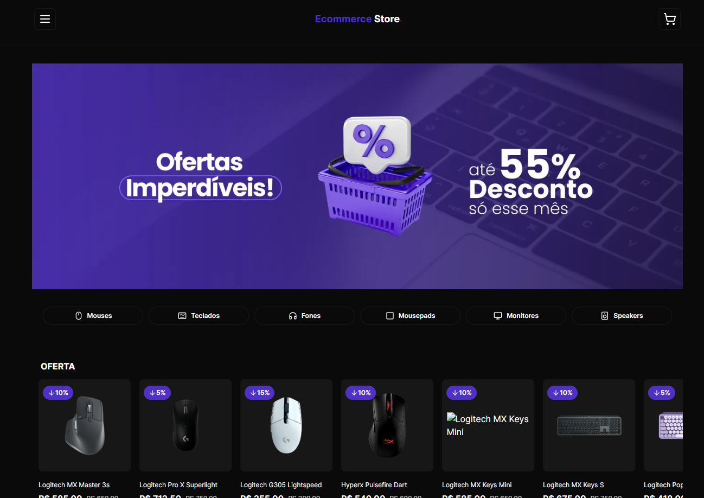

## Project ecommmerce para estudo de stripe

acesse o Projeto [ECOMMERCE STORE ](https://ecommerce-store-seven-lilac.vercel.app/) para mais detalhes.

## Sobre o Projeto

Projeto de estudos de E-commerce, simula uma aplicação de compra de produtos eletrônicos online, como teclados, mouses, monitores e gabinetes etc. Foi criado um carrinho de compras para os produtos, juntamente com a integração do Stripe para o método de pagamento e verificação.

O projeto foi ministrado pelo [Felipe Mota Rocha](https://github.com/felipemotarocha) em uma transmissão ao vivo para nos ensinar mais sobre o Next, o que com certeza agregou bastante ao nosso conhecimento.

## Tecnologias usadas

- React.js
- Next.js
- TypeScript
- Tailwind
- Shadcn ui
- lucide
- Prisma
- Node.js
- Postegre SQL

### Ate a próxima Att: Douglas S Borges.
